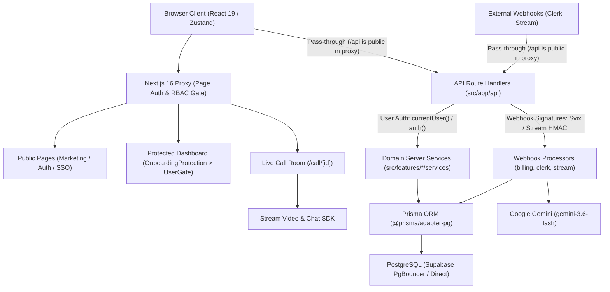

# DESIGN.md

Technical design and architectural reference for Evalo. For operational commands, rules, and boundaries, see [AGENTS.md](AGENTS.md).

---

## 1. Overview

Evalo is a two-sided mock technical interview platform connecting candidates with vetted industry interviewers.
- **Goals**: Provide low-friction slot booking backed by an auditable credit ledger; deliver reliable WebRTC video/chat; automatically settle session completion via participant presence tracking; generate structured, LLM-driven post-interview candidate feedback.
- **Non-Goals**: Real-time automated code execution/sandboxing during calls.

---

## 2. Architecture



### Data & Execution Flow
1. **Authentication & Ingestion**: Clerk manages identity. Webhooks sync user records into [prisma/schema.prisma](prisma/schema.prisma) via [src/app/api/webhooks/clerk/route.ts](src/app/api/webhooks/clerk/route.ts).
2. **Booking & Escrow**: Candidate reserves an interviewer slot in [details.server.service.ts](src/features/interviews/interviewer-details/services/details.server.service.ts). An atomic transaction deducts credits, writes a ledger entry, locks the slot, and registers a Stream WebRTC call room.
3. **Live Call**: Candidate and interviewer join `/call/[id]`. Tokens are minted in [call.server.service.ts](src/features/interviews/call/services/call.server.service.ts). Interviewers trigger live Gemini questions tailored to their expertise.
4. **Presence Settlement**: When the call ends, Stream dispatches webhook events to [src/app/api/webhooks/stream-business/route.ts](src/app/api/webhooks/stream-business/route.ts). [stream.server.service.ts](src/services/server/stream.server.service.ts) calculates co-presence intervals and settles earnings/compensation.
5. **Evaluation**: Stream transcript webhook triggers [src/app/api/webhooks/stream/route.ts](src/app/api/webhooks/stream/route.ts), sending transcript lines to Gemini (`gemini-3.6-flash`) to generate structured feedback stored in `Feedback`.

---

## 3. Key Decisions

| Decision | Context | Alternatives Considered | Architectural Rationale |
|---|---|---|---|
| **Prisma 7 with `@prisma/adapter-pg`** | Database layer connecting to hosted Supabase PostgreSQL. | Standard Prisma client, raw Drizzle ORM. | Enables pg-driver connection pooling for high-concurrency runtime queries via `DATABASE_URL` (Supabase PgBouncer pooler on port 6543) while using `DIRECT_URL` (direct port 5432) in [prisma.config.ts](prisma.config.ts) for DDL migrations. |
| **Clerk JWT Claims for Edge RBAC** | Role enforcement across candidate and interviewer views. | Querying DB in Next.js middleware on every request. | Eliminates per-request DB latency in [src/proxy.ts](src/proxy.ts) and [user-gate.tsx](src/app/(routes)/(protected)/user-gate.tsx). Trade-off: client must call `session.reload()` on onboarding completion because JWT claims are otherwise cached until token renewal. |
| **Bypassing `/api` in Proxy for Route-Level Auth** | Security architecture for API endpoints and webhooks. | Blanket auth gating for all `/api` routes in `src/proxy.ts`. | Avoids breaking external webhooks (which lack Clerk cookies) and prevents 307 HTML redirects on failed API calls. Enables each endpoint to enforce typed errors (`401`, `403`) or verify cryptographic signatures. |
| **Algorithmic Co-Presence Settlement** | Disputed or incomplete technical interview sessions. | Manual user completion buttons, admin dispute mediation. | [stream.server.service.ts](src/services/server/stream.server.service.ts) calculates merged intervals: `>= 50%` simultaneous presence resolves `MUTUAL`; `>= 85%` host wait with `<= 5%` candidate presence compensates `CANDIDATE_NO_SHOW`. Prevents collusion and abandonment without manual intervention. |
| **Immutable Double-Entry Credit Ledger** | Credit grants, slot bookings, refunds, and earnings. | Mutable `credits` balance counter only. | Every balance mutation writes a `CreditTransaction` row within `db.$transaction`. Prevents financial race conditions and provides complete auditability across purchases, bookings, and payouts. |
| **Custom Fetch Hooks over Heavy Client Cache** | Client data layer across dashboard tables and lists. | TanStack Query, SWR. | Uses [use-fetch.ts](src/hooks/use-fetch.ts), [use-infinite-fetch.ts](src/hooks/use-infinite-fetch.ts), and [use-mutation.ts](src/hooks/use-mutation.ts) with `ky`. Eliminates bundle overhead; protects against stale queries via `requestIdRef`. |
| **Asynchronous Gemini Webhook Evaluation** | Generating candidate performance evaluation reports. | Synchronous API call at call termination. | Handled in background via Stream's `call.transcription_ready` webhook in [src/app/api/webhooks/stream/route.ts](src/app/api/webhooks/stream/route.ts). User experiences zero latency waiting for AI report generation. |

---

## 4. Architectural Patterns

### Thin Route Handlers & Server Services
Route handlers only parse inputs and return responses. Business logic lives exclusively in `*.server.service.ts`:
```ts
// src/app/api/appointments/cancel-booking/route.ts -> delegates immediately
const { bookingId } = await request.json() as { bookingId: string };
await cancelBooking(bookingId);
return apiResponse({ statusCode: 200, data: null });
```

### Optimistic Atomic Locking
To prevent double refunds, double cancellations, or concurrent double settlements, queries use `updateMany` with strict state predicates inside [src/services/server/stream.server.service.ts](src/services/server/stream.server.service.ts):
```ts
const { count } = await prismaClient.booking.updateMany({
   where: { id: bookingId, status: 'SCHEDULED' },
   data: { status: 'COMPLETED', completionReason: reason }
});
if (count === 0) return false; // Aborts if another worker/event already modified state
```

### Typed Error Hierarchy & Uniform Response Formatting
Server services throw typed domain errors from [src/lib/app-error.ts](src/lib/app-error.ts). Handlers catch them with [src/lib/api-response.ts](src/lib/api-response.ts):
- `NotFoundError` (404), `ForbiddenError` (403), `ValidationError` (400), `ConflictError` (409), `UnauthorizedError` (401).
- Handlers catch with `apiErrorResponse({ error })`, automatically preserving HTTP status codes while protecting internal errors in production.

### Fast-Path Gate with Concurrency-Safe Self-Healing
In [src/app/(routes)/(protected)/user-gate.tsx](src/app/(routes)/(protected)/user-gate.tsx), once `sessionClaims.metadata.onboardingComplete` is true, requests pass with zero DB queries. If onboarding is incomplete or DB row is missing, it falls back to an upsert with `P2002` catch logic to gracefully handle webhook race conditions.

---

## 5. Cross-Cutting Concerns

- **Authentication & Authorization Architecture**:
  - **Edge Proxy (`src/proxy.ts`)**: Evaluates `roleRouteMap` for page navigation only (`/dashboard/*`), avoiding cascading auth waterfalls on page load. `/call/[id]` is intentionally role-agnostic at the proxy level.
  - **Why `/api(.*)` is Public in Proxy**: External machine webhooks lack browser Clerk session cookies. Furthermore, proxy-level interception redirects failed requests via HTTP 307 to HTML pages, breaking API contracts.
  - **Route-Level Authentication Mechanism**:
    1. *User API Handlers* (`/api/appointments/*`, `/api/interviewers/*`, `/api/payouts/*`, etc.): Authenticate within server services via Clerk's `currentUser()` or `auth()`. Missing identities throw `UnauthorizedError` (HTTP 401). Role or ownership mismatches throw `ForbiddenError` (HTTP 403).
    2. *Webhook Endpoints* (`/api/webhooks/*`): Authenticate via cryptographic signature verification. Clerk webhooks verify Svix headers with `CLERK_WEBHOOK_*_SECRET`; Stream webhooks verify HMAC headers via `STREAM_SECRET_KEY`.
    3. *Public Endpoints*: Read-only public metadata (e.g. `GET /api/platform-config`) requires no authentication.
- **Rate Limiting & Abuse Prevention**:
  - Arcjet token-bucket limiter in [src/security/arcjet.ts](src/security/arcjet.ts) is enforced on booking mutations in [details.server.service.ts](src/features/interviews/interviewer-details/services/details.server.service.ts) (`bookingLimiter`: 5 bookings/hour/user). This protects candidate credits and interviewer calendars from automated rapid-fire depletion.
  - Edge bot shielding in [src/proxy.ts](src/proxy.ts) is temporarily commented out during development to avoid blocking local testing and webhook tunneling tools (e.g., ngrok).
- **Logging & Diagnostics**:
  - Production logs omit diagnostic noise via strict linting rules (`no-console: "error"`). Webhook endpoints retain localized error logging (`// eslint-disable-next-line no-console`) because Svix and Stream retry mechanisms depend on host-level error visibility when debugging payload deserialization or signature discrepancies.

---

## 6. External Integrations

| Provider | Purpose | Authentication / Security | Failure Handling |
|---|---|---|---|
| **Clerk** | Identity, authentication, user metadata, plan billing. | API keys + Svix signature verification (`CLERK_WEBHOOK_USER_SECRET`, `CLERK_WEBHOOK_BILLING_SECRET`). | Webhooks return HTTP 400 on signature failure; retry-friendly HTTP 500 on database error. |
| **Stream Video & Chat** | WebRTC live video calls, live chat, call recording, audio transcription. | `STREAM_SECRET_KEY` server signing; `x-signature` verification for webhooks. | Call creation failure falls back to `streamStatus: "FAILED"` without rolling back user booking credits (retriable via `retryBooking`). |
| **Google Gemini** | Technical question generation and automated candidate transcript evaluations. | `GEMINI_API_KEY` via `@google/generative-ai` (`gemini-3.6-flash`). | Questions fall back to structured prompts; transcript evaluations return HTTP 500 on error so webhooks can retry. |
| **Supabase** | Managed PostgreSQL database. | Pooler connection string (`DATABASE_URL`, port 6543) and direct connection (`DIRECT_URL`, port 5432). | Singleton client with `@prisma/adapter-pg` driver adapter. |
| **Razorpay (Planned)** | Subscription payments and automated interviewer payouts. | API keys, webhook signatures, payout transfers API. | Will replace manual payout processing and Clerk billing once implemented. |

---

## 7. Build, Delivery & Deployment

- **Containerization Strategy**: The build uses Next.js `output: "standalone"` in [Dockerfile](Dockerfile), producing a minimal image containing only traced dependencies and static assets. The runtime runs as a non-privileged `nextjs` user on Node.js 20.
- **Continuous Delivery & Environments**:
  - `staging` is currently the active development and continuous deployment branch (no production branch exists yet; a production release pipeline will be added later).
  - Pushes to `staging` automatically run `npx prisma migrate deploy` via `DIRECT_URL`, build and publish Docker images to GitHub Container Registry (`ghcr.io`), and trigger zero-downtime container redeployment on Render via webhook. For operational rules and CI commands, see [AGENTS.md](AGENTS.md).

---

## 8. Architectural Constraints

1. **Network I/O Isolation from DB Transactions**: Prisma `$transaction` blocks must never await external network operations (Stream call creation, Gemini question generation, Clerk metadata sync). Database locks must commit or abort independently of external service latencies.
2. **Single Active Role Model**: Users operate strictly under a single assigned role (`CANDIDATE` or `INTERVIEWER`). Dual-role state ambiguity is prevented at both the schema and session claim levels.
3. **Ephemeral WebRTC Room Lifecycle**: Live call rooms are temporary channels keyed by unique `streamCallId` UUIDs; persistent state (presence logs, recordings, AI evaluation reports) is offloaded to PostgreSQL upon session termination.

---

## 9. Known Gaps & Technical Debt

- **Automated Testing Suite**: No unit, integration, or end-to-end tests exist (`ci.yml` explicitly bypasses test execution).
- **Payment & Payout Automation**: Payout requests are currently recorded in the `Payout` table as `PROCESSING` with manual fulfillment; Razorpay will be integrated for both credit purchases and automated interviewer payouts.
- **Arcjet Middleware Shielding**: Bot detection and shielding rules in [src/proxy.ts](src/proxy.ts) remain disabled during active development.
- **Admin Management Interface**: No administrative UI currently exists for adjusting user credits or marking payouts `PROCESSED`.
